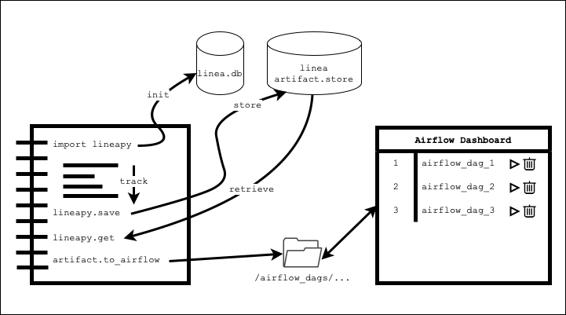
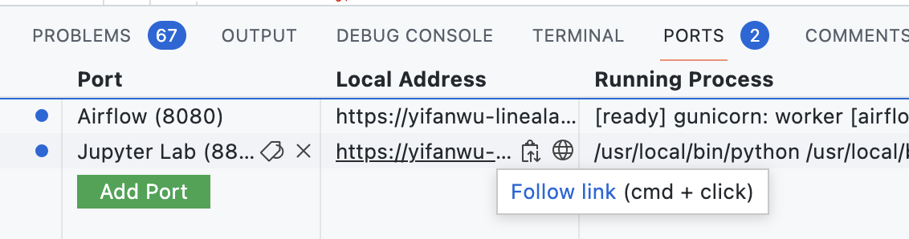

<p align="center">
    <a href="https://linea.ai/">
      
    </a>
</p>
<br />

[](https://github.com/LineaLabs/lineapy/actions/workflows/python-app.yml)


Lineapy is a Python library for capturing, analyzing, and automating data
science workflows.

On a high-level, Linea traces the code executed to get an
**understanding of the code and its context**.
This understanding of your development process allow Linea to
provide a set of tools that help you get more value out of your work.

A natural unit of organization for code are variables in the code---both
their value and the code used to create them. Our features revolve around these
units, which we call _artifacts_.

## Features

We are still early in the process but we currently support the following features:

- **Code cleanup**: often when working with data, we don't know what efforts
  will pan out. When we do have something we want to keep, we can save it as an
  artifact and create a version of the code that only includes the pieces necessary
  to recreate that artifact. This is called "Program Slicing" in the literature.
  Linea's slicing feature makes it easy to share and re-execute these work.
  - This is done automatically by calling the `lineapy.save` API on the variable of interest.
  - `/tests/housing.py` contains an example.
- **Pipeline extraction**: Automatic creation of [Airflow DAGs](https://github.com/LineaLabs/lineapy/issues/236) (and related systems) from Linea artifacts. Note that we take a radically different approach from tools like Papermill, because we are actually _analyzing the code_ to automatically instrument the optimizations.
  - This is done via the API `.to_airflow()` on a linea artifact that is returned either through `.save` or `.get`.
    By default, the generated airflow file is placed under your home directory's `airflow/dag` folders.
  - `examples/Demo_1_Preprocessing.ipynb` and `examples/Demo_2_Modeling.ipynb` contain two end-to-end examples.
- **Artifact store**: Saving and getting artifacts from different sessions/notebooks/scripts.
  - This is done via `lineapy.get` API of artifacts that were saved via `lineapy.save`.
  - You can also view a catalog of saved artifacts through the API `lineapy.catalog`.
  - `examples/1_Explorations.ipynb` + `/examples/2_APIs.ipynb` contain examples for all three APIs.

### Future Features

We are working towards a number of other features and have [created issues to describe some of them in Github, tagged with `User Story`](https://github.com/LineaLabs/lineapy/labels/User%20Story), which include:

- Metadata search e.g. "Find all charts that use this column from this table"
  [see issues on analyzing data sources](https://github.com/LineaLabs/lineapy/issues/22)
  and [analyzing SQL](https://github.com/LineaLabs/lineapy/issues/272)).
- Enhanced execution based versioning.
- Integration with existing infra, e.g., AWS, Airflow
- Support execution scale up, e.g., automatically creating the same version of the code with Dask.

If you have any feedback for us, please get in touch! We welcome feedback on
Github, either by commenting on existing issues or creating new ones. You can
also find us on [Twitter](https://twitter.com/linealabs) and [Slack](https://lineacommunity.slack.com/)!

## Getting Started



You can use `lineapy` by importing the library to your favorite notebook, saving artifacts, retrieving existing ones, or exporting them to airflow DAGs. Once exported, you can use the Airflow dashboard to run these DAGs (as shown in the image above).

***There are three options for getting started quickly:***

1. **Github CodeSpaces** - This is our demo environment where everything (including JupyterLab & Airflow) is already set up for you. You can get started immediately without having to install anything.
2. **Docker** - If you prefer to run things locally, then you can download our `lineapy` Docker image and run it.
3. **DIY** - if you want to dig deeper, then you can clone the repository to build & install `lineapy` locally.

We'll describe each of these options in more details below.

### 1. Github Codespaces

Click the green "<> Code" button above (in the homepage), and in the "Codespaces"
tab you can click on the gray button "New codespace".

The first time you load it might take a while to download Docker. Once the
VS Code interface loads, after a few seconds, the "PORTS" tab on the lower
panel should load (see the image below).



If you click on the globe icon (🌐) next to JupyterLab, it will open port 8888.
If you click the same globe icon next to Airflow, it will open port 8080.

By default, lab will have two demo notebooks open. Run Demo 1, and then Demo 2
to the end, then you will see the Airflow jobs deployed in the dashboard!

### 2. Docker

2.1. First install Docker and then authenticate to the [Github Container Registry](https://docs.github.com/en/packages/working-with-a-github-packages-registry/working-with-the-container-registry#authenticating-to-the-container-registry)
   so you can pull our private image.
2.2. Now you can pull and run our image to slice Python code:

```bash
docker run --rm -v $PWD:/app -w /app ghcr.io/linealabs/lineapy:main lineapy python --slice "p value" tests/housing.py
```

### 3. DIY - Cloning the Repository

You can also run Linea by cloning this repository and running the `lineapy`:

```bash
git clone git@github.com:LineaLabs/lineapy.git
cd lineapy
# Linea currently requires Python 3.8+
pip install -r requirements.txt
python setup.py install
lineapy python --slice "p value" tests/housing.py
```

Note that if you are not using Codespaces and are manually running Airflow and JupyterLab,
we also created convenient Makefile configs to start Airflow (`make airflow_start`) on
[`localhost:8080`](http://localhost:8080) and JupyterLab (`make jupyterlab_start`)
on [`localhost:8888`](http://localhost:8888).

## Specific Instructions for Cli and Jupyter

These features are currently exposed via two surfaces, one is the CLI and the
other is Jupyter, supporting all notebook interfaces.

### CLI

Currently, you can run Linea as CLI command to slice your Python code to extract
only the code that is necessary to recompute some result. Along the way, Linea
stores the semantics of your code into a database, which we are working on exposing
as well.

```bash
$ lineapy python --help
Usage: lineapy python [OPTIONS] FILE_NAME

Options:
  --db-url TEXT                   Set the DB URL. If None, will default to
                                  reading from the LINEA_DATABASE_URL env
                                  variable and if that is not set then will
                                  default to sqlite:///{LINEA_HOME}/db.sqlite.
                                  Note that {LINEA_HOME} will be replaced with
                                  the root linea home directory. This is the
                                  first directory found which has a .linea
                                  folder
  --slice TEXT                    Print the sliced code that this artifact
                                  depends on
  --export-slice TEXT             Requires --slice. Export the sliced code
                                  that {slice} depends on to {export_slice}.py
  --export-slice-to-airflow-dag, --airflow TEXT
                                  Requires --slice. Export the sliced code
                                  from all slices to an Airflow DAG {export-
                                  slice-to-airflow-dag}.py
  --airflow-task-dependencies TEXT
                                  Optional flag for --airflow. Specifies tasks
                                  dependencies in Airflow format, i.e. 'p
                                  value' >> 'y' or 'p value', 'x' >> 'y'. Put
                                  slice names under single quotes.
  --print-source                  Whether to print the source code
  --print-graph                   Whether to print the generated graph code
  --verbose                       Print out logging for graph creation and
                                  execution
  --visualize                     Visualize the resulting graph with Graphviz
  --help                          Show this message and exit.

# Run linea on a Python file to analyze it.
# --visualize creates a visual representation of the underlying graph and displays it
$ lineapy python --print-source --visualize tests/simple.py
...
# Use --slice to slice the code to that which is needed to recompute an artifact
$ lineapy python --print-source tests/housing.py --slice 'p value'
```

### Jupyter and IPython

You can also run Linea interactively in a notebook or IPython.

To do so the `lineapy` extension needs to be loaded. We have provided wrapper CLI commands to do this transparently,
`lineapy ipython` and `lineapy jupyter`. For example you can run `lineapy jupyter lab` to start JupyterLab with
the required extension auto loading.

This sets the `InteractiveShellApp.extensions` configuration option to include
`lineapy` for the kernel.

```python
$ lineapy ipython
Python 3.9.7 (default, Sep 16 2021, 08:50:36)
Type 'copyright', 'credits' or 'license' for more information
IPython 7.29.0 -- An enhanced Interactive Python. Type '?' for help.
[16:48:07] INFO     Connecting to Linea DB at sqlite:///.linea/db.sqlite

In [1]: import lineapy
   ...: x = 100
   ...: y = x + 500
   ...: z = x - 10
   ...: print(lineapy.save(z, "z").code)
x = 100
z = x - 10
```

This also works for starting `jupyter notebook` or `jupyter lab`, or any other
frontend which uses the ipython kernel.

You can also add `c.InteractiveShellApp.extensions = ["lineapy"]`
to your own IPython config (found by running `ipython locate profile default`).

_See [`ipython`'s documentation on their configuration](https://ipython.readthedocs.io/en/stable/config/intro.html) for more information_

For a larger example, you can look at [`examples/Explorations.ipynb`](./examples/Explorations.ipynb)

If you have an existing notebook, you can try running it through linea, to see if it
still works, and to save the resulting graph. For example:

```bash
lineapy jupyter nbconvert --to notebook --execute examples/Explorations.ipynb --inplace --allow-errors
```

If you would like to change the database that linea talks to, you can use the
`LINEA_DATABASE_URL` env variable. For example, to set it to `sqlite:///:memory:`
to use an in memory database instead of writing to disk.

## Known Bugs in Python Language Support

In order to properly slice your code, we have to understand different Python
language features and libraries. We are working to add coverage to support all
of Python, as well as make our analysis more accurate. We have
[a number of open issues to track what things we know we don't support in Python, tagged under `Language Support`](https://github.com/LineaLabs/lineapy/labels/Language%20Support).
Feel free to open more issues if you come across code that doesn't run or doesn't properly slice.

## What's next?

### Read the docs!

Before you can [contribute](https://github.com/LineaLabs/lineapy/blob/main/CONTRIBUTING.md) to our code base, we highly recommend you look at our docs to get a better understanding of `lineapy`.

### Build the docs

In the root directory, run the following command

```bash
sphinx-autobuild docs/source/ docs/build/html/
```
