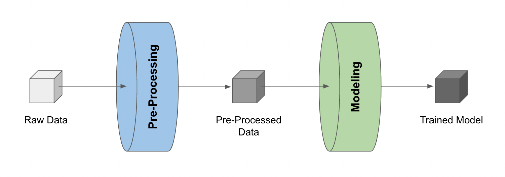

# Building a Pipeline from Development Code

To generate a pipeline from development code, first ensure variable(s) of interest have been
stored as LineaPy artifacts:

```python
lineapy.save(<VARIABLE-NAME>, "<artifact_name>")
```

Then, building a pipeline reduces to “stitching” these artifacts, like so:

```python
lineapy.to_pipeline(
    pipeline_name="<pipeline_name>",
    artifacts=["<artifact_name>", ...],
    dependencies={
        "<artifact_name>": {"<artifact_name>", ...},
        ...
    },
    output_dir="<output_dirpath>",
    framework="<framework_name>",
)
```

where

* `pipeline_name` is the name of the pipeline

* `artifacts` is the list of artifact names to be used for the pipeline

* `dependencies` is the dependency graph among artifacts

    * If artifact A depends on artifacts B and C, then the graph is specified as `{ A: { B, C } }`

    * If A depends on B and B depends on C, then the graph is specified as `{ A: { B }, B: { C } }`

* `output_dir` is the location to put the files for running the pipeline

* `framework` is the name of orchestration framework to use

    * LineaPy currently supports `"AIRFLOW"`, `"ARGO"`, `"KUBEFLOW"`, `"RAY"`, and `"SCRIPT"`

    * If `"SCRIPT"`, it will generate files that can run the pipeline as a Python script

    * Otherwise files corresponding to the orchestration framework selected will be generated

!!! info

    Check [`lineapy.to_pipeline()`][lineapy.api.api.to_pipeline] for more detailed API information.

## Airflow Example

For example, consider a simple pipeline that 1) pre-processes raw data and 2) trains a model with the pre-processed data.



With the pre-processed data and the trained model stored as LineaPy artifacts (which can be done during development sessions),
building an Airflow pipeline becomes as simple as the following:

```python
lineapy.to_pipeline(
    pipeline_name="iris_pipeline",
    artifacts=["iris_preprocessed", "iris_model"],
    dependencies={"iris_model": {"iris_preprocessed"}},
    output_dir="~/airflow/dags/",
    framework="AIRFLOW",
)
```

where `{"iris_model": {"iris_preprocessed"}}` is a way to indicate that the `"iris_model"` artifact
depends on the `"iris_preprocessed"` artifact.

Running this creates files (under `output_dir`) that can be used to execute the pipeline as an Airflow DAG, including:

* `<pipeline_name>_module.py`: Contains the artifact code refactored and packaged as function(s)

* `<pipeline_name>_dag.py`: Uses the packaged function(s) to define the framework-specific pipeline

* `<pipeline_name>_requirements.txt`: Lists any package dependencies for running the pipeline

* `<pipeline_name>_Dockerfile`: Contains commands to set up the environment to run the pipeline

where `<pipeline_name>` is `iris_pipeline` in the current example.

??? example "Output File Examples"

    === "iris_pipeline_module.py"

        ```python
        import pandas as pd
        from sklearn.linear_model import LinearRegression


        def get_iris_preprocessed():
            url = "https://raw.githubusercontent.com/LineaLabs/lineapy/main/examples/tutorials/data/iris.csv"
            df = pd.read_csv(url)
            color_map = {"Setosa": "green", "Versicolor": "blue", "Virginica": "red"}
            df["variety_color"] = df["variety"].map(color_map)
            df["d_versicolor"] = df["variety"].apply(lambda x: 1 if x == "Versicolor" else 0)
            df["d_virginica"] = df["variety"].apply(lambda x: 1 if x == "Virginica" else 0)
            return df


        def get_iris_model(df):
            mod = LinearRegression()
            mod.fit(
                X=df[["petal.width", "d_versicolor", "d_virginica"]],
                y=df["sepal.width"],
            )
            return mod


        def run_session_including_iris_preprocessed():
            # Given multiple artifacts, we need to save each right after
            # its calculation to protect from any irrelevant downstream
            # mutations (e.g., inside other artifact calculations)
            import copy

            artifacts = dict()
            df = get_iris_preprocessed()
            artifacts["iris_preprocessed"] = copy.deepcopy(df)
            mod = get_iris_model(df)
            artifacts["iris_model"] = copy.deepcopy(mod)
            return artifacts


        def run_all_sessions():
            artifacts = dict()
            artifacts.update(run_session_including_iris_preprocessed())
            return artifacts


        if __name__ == "__main__":
            # Edit this section to customize the behavior of artifacts
            artifacts = run_all_sessions()
            print(artifacts)
        ```

    === "iris_pipeline_dag.py"

        ```python
        import pathlib
        import pickle

        import iris_pipeline_module
        from airflow import DAG
        from airflow.operators.python_operator import PythonOperator
        from airflow.utils.dates import days_ago


        def dag_setup():
            pickle_folder = pathlib.Path("/tmp").joinpath("iris_pipeline")
            if not pickle_folder.exists():
                pickle_folder.mkdir()


        def dag_teardown():
            pickle_files = (
                pathlib.Path("/tmp").joinpath("iris_pipeline").glob("*.pickle")
            )
            for f in pickle_files:
                f.unlink()


        def task_iris_preprocessed():

            df = iris_pipeline_module.get_iris_preprocessed()

            pickle.dump(df, open("/tmp/iris_pipeline/variable_df.pickle", "wb"))


        def task_iris_model():

            df = pickle.load(open("/tmp/iris_pipeline/variable_df.pickle", "rb"))

            mod = iris_pipeline_module.get_iris_model(df)

            pickle.dump(mod, open("/tmp/iris_pipeline/variable_mod.pickle", "wb"))


        default_dag_args = {
            "owner": "airflow",
            "retries": 2,
            "start_date": days_ago(1),
        }

        with DAG(
            dag_id="iris_pipeline_dag",
            schedule_interval="*/15 * * * *",
            max_active_runs=1,
            catchup=False,
            default_args=default_dag_args,
        ) as dag:

            setup = PythonOperator(
                task_id="dag_setup",
                python_callable=dag_setup,
            )

            teardown = PythonOperator(
                task_id="dag_teardown",
                python_callable=dag_teardown,
            )

            iris_preprocessed = PythonOperator(
                task_id="iris_preprocessed_task",
                python_callable=task_iris_preprocessed,
            )

            iris_model = PythonOperator(
                task_id="iris_model_task",
                python_callable=task_iris_model,
            )

            iris_preprocessed >> iris_model

            setup >> iris_preprocessed

            iris_model >> teardown
        ```

    === "iris_pipeline_requirements.txt"

        ```
        lineapy
        pandas==1.3.5
        matplotlib==3.5.1
        scikit-learn==1.0.2
        ```

    === "iris_pipeline_Dockerfile"

        ```
        FROM apache/airflow:latest-python3.10

        RUN mkdir /tmp/installers
        WORKDIR /tmp/installers

        # copy all the requirements to run the current dag
        COPY ./iris_pipeline_requirements.txt ./
        # install the required libs
        RUN pip install -r ./iris_pipeline_requirements.txt

        WORKDIR /opt/airflow/dags
        COPY . .

        WORKDIR /opt/airflow

        CMD [ "standalone" ]
        ```

## Running Locally

With the pipeline files generated, we can quickly test running the pipeline locally.
First, run the following command to build a Docker image:

```bash
docker build -t <image_name> . -f <pipeline_name>_Dockerfile
```

where `<pipeline_name>_Dockerfile` is the name of the automatically generated Dockerfile and
`<image_name>` is the image name of our choice.

We then stand up a container instance with the following command:

```bash
docker run -it -p 8080:8080 <image_name>
```

For `framework="AIRFLOW"`, this will result in an Airflow instance
with an executable DAG in it.
