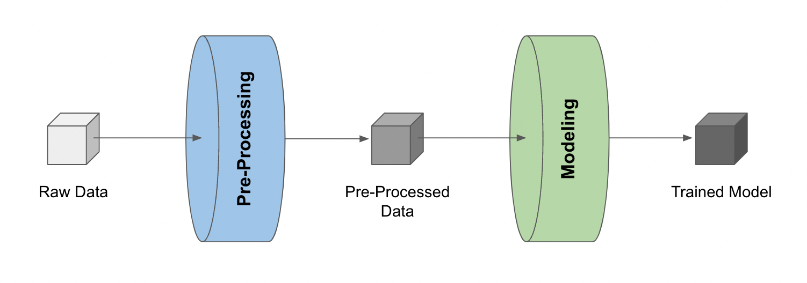

.. _pipeline_basics:

Basics
======

Data science workflows revolve around building and refining pipelines, i.e., a series of processes that transform data into useful information/product
(read more about pipelines :ref:`here <concepts>`).

Traditionally, this is often manual and time-consuming work as data scientists (or production engineers) need to transform messy development code
into deployable scripts for the target system (e.g., Airflow).

Having the complete development process stored in artifacts, LineaPy can automate such code transformation, accelerating transition from development to production.

For example, consider a simple pipeline that 1) pre-processes raw data and 2) trains a model with the pre-processed data.

Pipeline Creation
-----------------

Once we have the pre-processed data and the trained model stored as LineaPy artifacts (which can be done during development sessions),
building a pipeline reduces to “stitching” these artifacts, like so:

.. code:: python

   import lineapy

   # Build an Airflow pipeline using artifacts
   lineapy.to_pipeline(
      pipeline_name="iris_pipeline",
      artifacts=["iris_preprocessed", "iris_model"],
      dependencies={"iris_model": {"iris_preprocessed"}},
      output_dir="./output/pipeline_basics/",
      framework="AIRFLOW",
   )

where ``{"iris_model": {"iris_preprocessed"}}`` is a way to indicate that the ``"iris_model"`` artifact
depends on the ``"iris_preprocessed"`` artifact (check :func:`lineapy.to_pipeline` for more detailed API information).

Running this creates files that can be used to execute the pipeline as an Airflow DAG, including:

* ``<pipeline_name>_module.py``: Contains the artifact code refactored and packaged as function(s)

* ``<pipeline_name>_dag.py``: Uses the packaged function(s) to define the framework-specific pipeline

* ``<pipeline_name>_requirements.txt``: Lists any package dependencies for running the pipeline

* ``<pipeline_name>_Dockerfile``: Contains commands to set up the environment to run the pipeline

where ``<pipeline_name>`` is ``iris_pipeline`` in the current example.

.. note::

   If you want hands-on practice,
   check out `this <https://github.com/LineaLabs/lineapy/blob/main/examples/tutorials/02_build_pipelines.ipynb>`_ tutorial notebook.

Output Files
------------

.. _iris_pipeline_module:

Let's take a closer look at these files. First, we have ``iris_pipeline_module.py`` looking as follows:

.. code:: python

    import pandas as pd
    from sklearn.linear_model import LinearRegression

    def get_iris_preprocessed():
        url = "https://raw.githubusercontent.com/LineaLabs/lineapy/main/examples/tutorials/data/iris.csv"
        df = pd.read_csv(url)
        color_map = {"Setosa": "green", "Versicolor": "blue", "Virginica": "red"}
        df["variety_color"] = df["variety"].map(color_map)
        df["d_versicolor"] = df["variety"].apply(lambda x: 1 if x == "Versicolor" else 0)
        df["d_virginica"] = df["variety"].apply(lambda x: 1 if x == "Virginica" else 0)
        return df

    def get_iris_model(df):
        mod = LinearRegression()
        mod.fit(
            X=df[["petal.width", "d_versicolor", "d_virginica"]],
            y=df["sepal.width"],
        )
        return mod

    def run_session_including_iris_preprocessed():
        # Given multiple artifacts, we need to save each right after
        # its calculation to protect from any irrelevant downstream
        # mutations (e.g., inside other artifact calculations)
        import copy

        artifacts = dict()
        df = get_iris_preprocessed()
        artifacts["iris_preprocessed"] = copy.deepcopy(df)
        mod = get_iris_model(df)
        artifacts["iris_model"] = copy.deepcopy(mod)
        return artifacts

    def run_all_sessions():
        artifacts = dict()
        artifacts.update(run_session_including_iris_preprocessed())
        return artifacts

    if __name__ == "__main__":
        # Edit this section to customize the behavior of artifacts
        artifacts = run_all_sessions()
        print(artifacts)

We can see that LineaPy used artifacts to automatically 1) clean up their code to retain only essential operations and 2) package the cleaned-up code into importable functions.

.. _iris_pipeline_dag:

And we see ``iris_pipeline_dag.py`` automatically composing an Airflow DAG with these functions:

.. code:: python

    import pathlib
    import pickle

    import iris_pipeline_module
    from airflow import DAG
    from airflow.operators.python_operator import PythonOperator
    from airflow.utils.dates import days_ago

    def dag_setup():
        pickle_folder = pathlib.Path("/tmp").joinpath("iris_pipeline")
        if not pickle_folder.exists():
            pickle_folder.mkdir()

    def dag_teardown():
        pickle_files = (
            pathlib.Path("/tmp").joinpath("iris_pipeline").glob("*.pickle")
        )
        for f in pickle_files:
            f.unlink()

    def task_iris_preprocessed():

        df = iris_pipeline_module.get_iris_preprocessed()

        pickle.dump(df, open("/tmp/iris_pipeline/variable_df.pickle", "wb"))

    def task_iris_model():

        df = pickle.load(open("/tmp/iris_pipeline/variable_df.pickle", "rb"))

        mod = iris_pipeline_module.get_iris_model(df)

        pickle.dump(mod, open("/tmp/iris_pipeline/variable_mod.pickle", "wb"))

    default_dag_args = {
        "owner": "airflow",
        "retries": 2,
        "start_date": days_ago(1),
    }

    with DAG(
        dag_id="iris_pipeline_dag",
        schedule_interval="*/15 * * * *",
        max_active_runs=1,
        catchup=False,
        default_args=default_dag_args,
    ) as dag:

        setup = PythonOperator(
            task_id="dag_setup",
            python_callable=dag_setup,
        )

        teardown = PythonOperator(
            task_id="dag_teardown",
            python_callable=dag_teardown,
        )

        iris_preprocessed = PythonOperator(
            task_id="iris_preprocessed_task",
            python_callable=task_iris_preprocessed,
        )

        iris_model = PythonOperator(
            task_id="iris_model_task",
            python_callable=task_iris_model,
        )

        iris_preprocessed >> iris_model

        setup >> iris_preprocessed

        iris_model >> teardown

Next, we see ``iris_pipeline_requirements.txt`` listing dependencies for running the pipeline:

.. code:: none

    lineapy
    pandas==1.3.5
    matplotlib==3.5.1
    scikit-learn==1.0.2

Finally, we have the automatically generated Dockerfile (``iris_pipeline_Dockerfile``), which facilitates pipeline execution:

.. code:: docker

    FROM apache/airflow:latest-python3.10

    RUN mkdir /tmp/installers
    WORKDIR /tmp/installers

    # copy all the requirements to run the current dag
    COPY ./iris_pipeline_requirements.txt ./
    # install the required libs
    RUN pip install -r ./iris_pipeline_requirements.txt

    WORKDIR /opt/airflow/dags
    COPY . .

    WORKDIR /opt/airflow

    CMD [ "standalone" ]

.. _testingairflow:

Testing Locally
---------------

With these automatically generated files, we can quickly test running the pipeline locally.
First, we run the following command to build a Docker image:

.. code:: bash

    docker build -t <image_name> . -f <pipeline_name>_Dockerfile

where ``<pipeline_name>_Dockerfile`` is the name of the automatically generated Dockerfile and
``<image_name>`` is the image name of our choice.

We then stand up a container instance with the following command:

.. code:: bash

    docker run -it -p 8080:8080 <image_name>

In the current example where we set ``framework="AIRFLOW"``, this will result in an Airflow instance
with an executable DAG in it.
