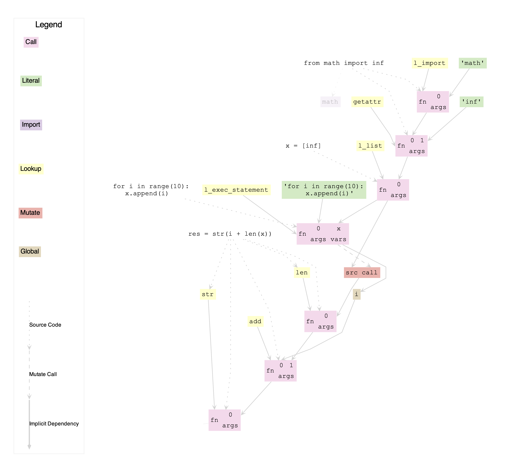
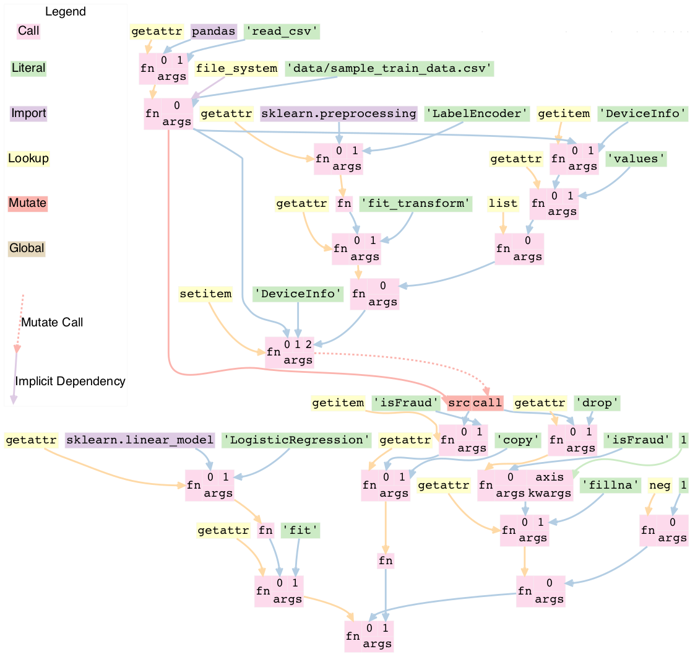

.. _internals:

LineaPy Internals
=================

This document describes some of the high level code layout and implementation decisions.

What is a LineaPy Graph?
------------------------

In LineaPy, we create a graph as we execute Python code, of every function that
was called and its dependencies. We use this graph to do "program slicing,"
meaning that we can understand all the code that is required to reproduce some
value in your program.

As well as the program graph, we also store some information about how things
were executed and the source code the graph was derived from.

We persist our graph structure to SQL (currently SQLite) using SQAlchemy,
an ORM. The :mod:`lineapy.data.types` file stores the graph nodes
and the :mod:`lineapy.db.relational` file stores the SQLAlchemy wrappers.

TODO: Visual of SQL table relationships

We have 6 different types of nodes in our graph currently. They all have an ID,
and then have different attributes to describe their behavior. Each node conceptually
has some "value" at runtime, so that when a node refers to another node, it can
refer to its value.

Example:

This is an example file that when traced will make all six nodes:

.. code-block:: python

   import lineapy
   from math import inf

   x = [inf]
   for i in range(10):
      x.append(i)

   res = str(i + len(x))


These are the nodes that would be created from tracing this code
(note that some attributes, like the session ID and source code references
have been elided in the interest of transparency. The IDs are also UUIDs normally,
but I have given them names for readability):

.. code-block:: python

   # The import node represents importing some module, in this case `math`.
   ImportNode(
      id='math',
      name='math',
   )

   # A lookup node is similar to an import, but it looks up some name of a function
   # from the builtins, in this case `getattr`
   LookupNode(
      id='getattr',
      name='getattr'
   )
   # The literal node represents a literal primitive python value, like strings, ints,
   # floats, etc. In this case it is the string "inf"
   LiteralNode(
      id='inf_str',
      value='inf'
   )
   # When we import something from a module, this is translated as an import
   # followed by a getattr call. This is represented by a CallNode, which
   # represents calling some function with some arguments.
   # In this case it gets the `inf` attribute from the `math` module.
   CallNode(
      id='inf',
      function_id='getattr',
      positional_args=['math', 'inf_str']
   )
   # We have our own internal functions, all prefixed with `l_` that we use
   # to implement certain python behavior. l_list takes a number of arguments
   # and makes a list out of them. You might ask, why don't we just use the builtin
   # `list`? Well that takes in some iterable as it's first argument.
   # Another way to look at `l_list` is a function equivalent of the built in
   # `[]` syntax.
   LookupNode(
      id='l_list',
      name='l_list'
   )
   # We then finally are able to create `x` by calling l_list with infinity
   CallNode(
      id='x',
      function_id='l_list',
      positional_args=['inf']
   )

   # Now we have a for loop. We currently "black box" this, treating it as a string
   # which we end up `exec` through `l_exec_statement`
   LiteralNode(
      id='loop_str',
      value='for i in range(10):\n    x.append(i)'
   )
   # We use our builtin `l_exec_statement` to compile and execute this code
   LookupNode(
      id='l_exec_statement',
      value='l_exec_statement'
   )
   # Now we can actually call this string. Also notice that we pass in `x`
   # as a dependency of this node, as a "global read" meaning that this node
   # reads the global `x` we defined, for the node with id `x`.
   CallNode(
      id='loop',
      function_id='l_exec_statement',
      positional_args=['loop_str'],
      global_reads={"x": "x"}
   )
   # Executing this loop creates a "mutate node" for value of x,
   # meaning that any later references to x should refer to this mutate node,
   # so that the code that mutated it, the loop, is also included implicitly
   # as a dependency
   MutateNode(
      id='x_mutated',
      source_id='x'
      call_id='loop'
   )
   # Executing this loop actually also sets the global `i`. We represent this
   # with a GlobalNode, representing the global variable set by some call (we'll
   # talk about how we detect the setting later):
   GlobalNode(
      id='i_global',
      name='i',
      call_id='loop'
   )

   # Now when computing the result, we can point to this global node `i_global`
   # as our input, as well as the mutate node
   LookupNode(
      id='len',
      value='len'
   )
   CallNode(
      id='len_x',
      function_id='len',
      positional_args=['x_mutated'],
   )
   LookupNode(
      id='add',
      value='add'
   )
   CallNode(
      id='added',
      function_id='add',
      positional_args=['i_global', 'len_x'],
   )
   LookupNode(
      id='str',
      value='str'
   )
   CallNode(
      id='res',
      function_id='str',
      positional_args=['added'],
   )

This can also be seen by visualizing the artifact.

.. code-block:: python

   import lineapy

   artifact = lineapy.save(res, "res")
   artifact.visualize()




Creating Graphs
---------------

One main part of the codebase involves creating a graph from Python code.

We create this graph at runtime as we execute the Python code. We start
with the AST of the Python and visit that as we turn it into a graph.

That goes through a number of steps, which we outline below, from outside in:

1. Entrypoint
~~~~~~~~~~~~~

We currently support two ways to start tracing from LineaPy. The CLI,
which is used to trace Python scripts, and our Jupyter integration which is
used in Jupyter Notebooks and IPython. Both of them go from source, to AST,
to a graph.

CLI
++++

In :mod:`lineapy.cli.cli` we support running a Python file from the
CLI. That can produce some output, such as (1) printing out sliced code/graph,
and (2) optionally to airflow file.

Exceptions
**********

We also call `set_custom_excepthook` which is used to override Python's
`sys.excepthook` so that if an exception is raised from executing user's code
then we ignore all the frames added by `lineapy` (see "Exception handling" later
in the doc).

Jupyter / IPython
+++++++++++++++++

We also supporting tracing using IPython (and so by proxy, Jupyter).

This is implemented in the :mod:`lineapy.editors.ipython` file. That class
provides three main entry points:

#. `start()`: Starts tracing by adding a function to `input_transformers_post <https://ipython.readthedocs.io/en/stable/config/inputtransforms.html#string-based-transformations>`_ which takes in a list of strings of the cell contents, and returns a list of strings which are executed by IPython.
#. `stop()`: Stops the tracing, removing this function from the `input_transformers_post`.
#. `visualize()`: output a visual of the current state of the graph.

In our input transformer, we save the code from the cell in a global
and return the same lines from every cell, which call out to a function
in the `ipython` module, `_end_cell`, which looks at the lines of code,
transforms them through LineaPy, and optionally returns a value if one should
be "returned" from the cell (i.e. if the last line is an expression that does not
end with a ';').

Exceptions
**********

IPython does not use `sys.excepthook` so we have to take a different approach
for handling exceptions in Jupyter. Instead, we set override the
`_get_exc_info` method on the IPython shell, to have the same effect.

2. Parsing the AST
~~~~~~~~~~~~~~~~~~

Once we have initialized lineapy with the user's code, we traverse that through the
python AST using a visitor defined in :mod:`lineapy.transformer.node_transformer`.

As we traverse the AST, we create nodes for each piece of it.

3. Creating nodes
~~~~~~~~~~~~~~~~~

This `NodeTransformer` relies on an :class:`lineapy.instrumentation.tracer.Tracer`
to actually create the nodes.

The general process to create a node is:

#. Create new instance of some `Node` subclass defined in `types.py`, giving it a new UUID.
#. Then in `process_node` pass the newly created node to the `Executor` to execute it, and return any "side effects" that happen
#. We react to those side effects, by potentially adding more nodes to the graph (which goes through step 1 one more time).
#. Write this node to the database.

We go into these side effects lower down, since they pertain to multiple layers.

4. Executing nodes
~~~~~~~~~~~~~~~~~~

As mentioned above, the `Tracer` passes on the responsibility of executing the
node to the :class:`lineapy.execution.executor.Executor`. This is responsible
for keeping a mapping of each node and its value after being executed.

It returns a number of "side effects" which say things like "Node xxx was modified"
that the tracer can then handle. These are created based on the `inspect_function`'s
side effects that are described below.

5. Determine function side effects
~~~~~~~~~~~~~~~~~~~~~~~~~~~~~~~~~~

When we try to execute a `CallNode`, we need to know things like "does this
modify any of its arguments?" to understand how it affects the graph.

This reasoning is implemented in :mod:`lineapy.execution.inspect_function`
which is basically one big switch statement, that understands certain
Python functions. If some function is not being sliced properly,
it is likely due to it being missing from this file.

This also returns a list of "side effects," which bubble up to the Executor.
However, unlike the side effects returned from the executor, which refer to things
by their node ID, in the `inspect_function`, the side effects instead refer to
which arg/kwargs/value was modified. So it would say instead "The first arg was modified".

This is to keep the inspect_function from having to know anything about nodes,
and instead just about describing the side effects given some Python function call
and values.

Reading graphs
--------------

After we have created a graph, we can perform a number of operations on it.

Many of these use the :mod:`lineapy.data.graph` object which represents
a collection of nodes. It can sort them topologically and by line number, meaning
that any node will come after its parents, and all nodes with line numbers will
be sorted by those as well.

Note: It currently also include the session context, but we don't really use this from the
graph. We could remove this

Re-execution (steps 4-5)
~~~~~~~~~~~~~~~~~~~~~~~~

We can re-execute a graph to re-run the Python function calls that were saved in it.

We keep the executor separate from the tracer, in order to facilitate this, so that
we only need the `Executor` for re-execution, using the `execute_graph` method,
which simply iterates through a number of nodes and executes each of them.

This is currently tested in our end to end tests, by re-executing every graph,
but it is not currently exposed to the user.

Slicing
~~~~~~~

One common use of a graph is to "slice it", meaning removing the nodes
that are not ancestors of some input nodes.

We can use this then to output a "clean up" source code, where any
lines that are not required to reproduce some result are removed.
What this means is that the graph structure needs to represent program
dependence, which is why some of our more complicated analysis are required.

This is implemented in :mod:`lineapy.graph_reader.program_slice`.

Visualizing
~~~~~~~~~~~

We currently supporting visualizing a graph using Graphviz for debugging
and teaching purposes. This is implemented in the
:mod:`lineapy.visualizer` directory with three main files:

#. :mod:`lineapy.visualizer`: Provides a `Visualizer` object which is the publicly exposed
   interface for visualizing a graph. In supports creating it for a number of
   different scenarios, each with their own configurations set. For example,
   we want to show more detail in our testing than in our public API.
   The visualizer also optionally supports taking a `Tracer` object, along
   with the required `Graph` object, to show more details that are present
   in that object, like the variable assignments. However, this is not always
   available, like when visualizing only a certain artifact, which can happen
   during re-execution, so the tracer is unavailable.
   It also supports a number of ways to viewing the visualization, like
   as SVG, PDF, or as Jupyter Output.
#. :mod:`lineapy.visualizer.graphviz`: This files manages actually creating the graphviz source
   using the `Graphviz <https://graphviz.readthedocs.io/en/stable/index.html>`_
   library. It renders each edge and node, and also renders a legend.
#. :meth:`lineapy.visualizer.visual_graph.to_visual_graph`: This takes in the Graph and (optional) Tracer and returns
   a list of nodes and edges in a form that is closer to how Graphviz works.
   The goal of having this extra abstraction layer, as opposed to just emitting
   graphviz directly, is ensure a logically consistent rendering. It is similar
   to the MVC paradigm, or like React's components. This would be equivalent
   to the props, where as the graphviz file is equivalent to taking those
   props and then rendering them.

Whenever a new node type is added, or any is modified, the graphviz and visual_graph
files should be updated to handle it.

Outputting to airflow
~~~~~~~~~~~~~~~~~~~~~

On top of just slicing the code, we also support creating an Airflow DAG out
of the resulting code. This is currently implemented through string templating
in :mod:`lineapy.plugins.airflow` to create a file that airflow can understand.

All of the code is currently saved in one `PythonOperator`.

This is exposed to users in two ways:

1. In the cli through the `--export-slice-to-airflow-dag` flag, which will
   save the resulting DAG to the current directory.
2. In our API (usable in a script or in Jupyter) through the `to_airflow` method
   on a saved artifact. This is implemented in :mod:`lineapy.graph_reader.apis`.
   Instead of saving to the current directory, this tries to find Airflow's
   DAGs folder, by looking at the `AIRFLOW_HOME` environment variable and saving it
   in there, so it is picked up by Airflow automatically.


Put it all together
~~~~~~~~~~~~~~~~~~~~~~~~~

.. code-block:: python

   import pandas as pd
   from sklearn.linear_model import LogisticRegression
   from sklearn.preprocessing import LabelEncoder

   train = pd.read_csv("data/sample_train_data.csv")

   train['DeviceInfo'] = LabelEncoder().fit_transform(list(train['DeviceInfo'].values))

   y = train['isFraud'].copy()

   train = train.drop('isFraud', axis=1)
   train = train.fillna(-1)

   regression_model = LogisticRegression().fit(train, y)




Cross cutting concerns
----------------------

Code Analysis (steps 3-5)
~~~~~~~~~~~~~~~~~~~~~~~~~

There are also a number of code analysis pieces that span the tracer-executor-inspect function,
which we describe here.

Python Globals
++++++++++++++

The first is the ability to track what Python globals are set at any time.

For example in the code `a = 1\nb = a + 1` we have to know what the values `a`
and `b` are at any given time. We can't simply keep a values mapping as Python
does because we also need to know the Node of each variable, not just it's
value, so we can stitch them together into the graph.

We currently keep this mapping in the `Tracer`. By the time it has been saved
to the DB, the variable analysis has been erased. So the executor also has
no knowledge of the variables.

The only exception to this is when dealing with execs and black boxes, which we
touch on below.

Note: This is currently a problem for expressions like `a = b` which are entirely
erased. This is fine for re-execution, but for slicing, this line is then omitted
in the slice. We might want to re-consider this choice and instead have some
way to persist the variables in the graph, possibly with some form of Assign
and Load nodes.

Mutations and views
+++++++++++++++++++

Since Python is not a pure functional language, many operations will mutate their
arguments. Not only that, since objects often store references to one another
internally, mutating one object can therefore mutate other objects as well.

For example, in this code:

.. code-block:: python

   x = []
   y = [x]
   y[0].append(1)

if we try to slice on either `x` or `y`, we will need to include all three lines
to get back the proper result for either variable. We represent this internally
with two concepts:

1. We say a node is "mutated" if the semantics of the Python value it refers to has changed.
   A mutation is often the result of calling some function. Another way to think about this
   is that if calling some function would change how downstream usage or evaluation
   of a node behaves, then we can say that function call mutated that node.
2. We saw two nodes are "views" of one another if mutating one node could mutate
   the other node. Since it's better to be conservative in slicing, we assume it does.
   We currently treat views as a bidirectional relationship, meaning we assume if
   mutating a could affect b, then the opposite is also true.

Once we start with these two concepts a few things fall out:

#. We need to know during each function call what nodes are directly mutated.
#. We need a way in the graph to have any later references to a node that was
   mutated implicitly also depend on the call node that mutated it, so that this
   will be included in the slice.
#. We need to know during each call what views were added.
#. We need to know when a node is mutated, what other nodes are views of it.

For #1, this starts in `inspect_function.py`. If we know calling a function
will mutate a value, we return a `MutatedValue` with a pointer to that value
as one of the side effects. Then in `executor.py` we "resolve" that to a
`MutatedNode` value, since we now know the node ID of the mutated value, not
just if it was say the first argument.

For #2, we add a new node type, a `MutateNode`, which points both
to its original value and the call node which created it. Then in the `Executor`
when we see we have a `MutatedNode` side effect we know to make a new
`MutateNode` (note the difference, one is a side effect saying a node was
mutated, the other is a new node type that represents the result of this mutation).
It also updates a mapping that points from each source node to its mutate node,
so that when we then go to lookup a node, we point to the mutate node, instead
of the source. This mapping and the logic to update it is kept in :mod:`lineapy.instrumentation.mutation_tracker`.

For #3, similar to #1, `inspect_function` returns a `ViewOfValues`, which is transformed
into a `ViewOfNodes` in the `Executor`.

And for #4, when we see this side effect in the `Tracer`, we update our internal
data structure keeping track of all views in `mutation_tracker.py`. And when we
see that a node is mutated, we look into this data structure to also see what
other nodes should be mutated.

Execs and "black boxes"
+++++++++++++++++++++++

Currently, we don't try to understand any builtin Python control flow or
anything besides expressions. So for constructs like function definitions,
loops, if statements, while statements we treat them as "black boxes".

This mostly works fine, but we still need to know what global variables a black box
wrote to and which it read from, in order to add it properly to the graph.

The life of a black box node goes through a number of stages:

#. In the `node_transformer` when we see the AST statements that correspond
   to things like for loops, we tell the `Tracer` to add a a literal
   node for the string, and then a `CallNode` which execs the string.
   We differentiate between exec-ing a "statement" versus an "expression",
   since an expression will return some value, while a statement does not.
#. The functions we use to do the `exec` are defined in :mod:`lineapy.utils.lineabuiltins` , :func:`lineapy.utils.lineabuiltins.l_exec_statement` and :func:`lineapy.utils.lineabuiltins.l_exec_expr` . Along with
   actually calling `exec` , they set up the source code context, so that
   exceptions raised in code that is `exec` ed has the proper traceback
   and also make sure to use it uses the correct globals.
#. Before this call node is executed, we set the :class:`lineapy.execution.context.ExecutionContext` , which is a global storing the current node and executor being called.
   This allows us to use the current binding of the global variables in the `l_exec_expr`
   and `l_exec_statement` functions.
#. When we are tracing code, we initialize the globals with all globals we have traced
   so far. However, when re-executing, we look at the `global_reads` dictionary
   on the CallNode to see what variables are read and what nodes they correspond to.
   On to how that is set below...
#. After calling the function, the globals in the context now contains all the
   new globals that were set or re-assigned in the exec. We look at this dict,
   and check which nodes have changed to see what globals have been written to.
   To see what globals were read, we use a dict subclass called :class:`lineapy.execution.globals_dict.GlobalsDict` which keeps track of all `__getitem__` calls.
#. We store all values that were accessed under the `global_reads` dictionary
   on the `CallNode`, so when we slice on this node, it will include those dependencies,
   and when we re-execute it, it will know which globals to set.
#. For each new global that was set, or updated, we create a `GlobalNode`, which
   points to the call node that created the global, as well as the variable name.
   Also in the Executor we add an item to the internal mapping `_node_to_globals`
   which keeps track of all the globals returned by each node. Then, later on,
   if a node refers to this `GlobalNode`, it can look up in this mapping to find
   the value that was set in the globals when executing that node.

One subtle case to consider is that globals are not only read and wrote during
the execution of our exec nodes, but also potentially during execution of functions
that were defined in them, or any other function that modifies or sets a global.

For example:

.. code-block:: python

   a = 1
   def inc_i():
      global a
      a += 1

   lineapy.save(a, "first")
   inc_i()
   lineapy.save(a, "second")

In this case, we will call `l_exec_statement` with the body of text of `inc_i` and this
will create a `GlobalNode` for `inc_i` that points to that CallNode.

Then, calling it will create a `CallNode` that will use that global node of `inc_i`
as the function, set `global_reads` to map `"a"` to the original `a` literal node,
and create a new `GlobalNode` for the new value of `a`.

Another way of thinking about the `GlobalNode` is a way to represent things that
were "returned" by a function call implicitly. Instead of making a new node,
we could change how we think about nodes, that instead of having one returned value,
they have also have additional variables they set, and/or possibly multiple return values.
This would make it more symmetrical to how we think about function inputs.

In a similar manner, we could remove `MutateNode` s and represent them instead
in our function inputs.

However, this would require changing all our references to not only say "we depend on node XXX"
but also what part of it we depend on like "we depend on the return value of node XXX" or
"we depend on the global x set by node XXX" or "we depend on the mutated value of node YYY set by
calling XXX."

For now though, we do have this asymmetry, where the global inputs show up
as the `global_reads` property on the `CallNode` and the global outputs show up
as separate `GlobalNode` s.

External side effects
+++++++++++++++++++++

Another example of implicit state, besides global variables, are external
side effects, like writing to a file or reading from SQL. This shows up in
two types of use cases. The first, is when you have some node that depends
on another implicitly based on a side effect, like this:

.. code-block:: python

   write_file("hello", 'text')
   x = read_file("hello")

If we slice on `x` we probably also want to include the write file, since
this needs to be executed before we read it.

A similar use case comes up if the result of our script is writing to a file,
and we want to preserve this effect, to say create an airflow job that
writes to a file. We can write this like:

.. code-block:: python

   write_file("hello", 'text')
   lineapy.save(lineapy.file_system, "wrote file")

We can think about these use cases under this framework:

#. We have an implicitly defined node for each type of side effect,
   like touching the file system or writing to S3.
#. Whenever we have a node which writes a side effect, we create a mutate
   node for that implicitly defined node.
#. Whenever we have a node that depends on the state of that side effect,
   we add that node as an implicit dependency.
#. Whenever we manually refer to that implicit node, as in :class:`lineapy.utils.lineabuiltins.file_system`
   we have this also have an implicit dependency on the most recent version of that node.

Currently we only support the broad categories of side effects, but we can
expand this to have more fine grained support in the future, like writing to a
particular file.

We implement the following framework by:

#. We create a global for `file_system` and `db` in :mod:`lineapy.utils.lineabuiltins`. Both of these
   are instances of `ExternalState`, a class defined in that file.
   This lets them be accessed through a `LookupNode`.
#. We can bubble this up from the `inspect_function.py` by passing an instance of `ExternalState` in as
   an arg for `MutatedValue` or `ViewOfValues` to represent that a function is mutates that state
   or is a view of it (subsequent mutates will mutate that state).
#. That is bubbled up through the `Executor`, so that it's `MutateNode` can also point to a `ExternalState` instead of just a node ID.
#. At the `Tracer` level, when we are looking at side effect, if it refers to an `ExternalState`, we make
   a lookup node for it.
#. In the `Executor` as we are processing this `LookupNode`, in `execute_node`, we see that it returns
   an `ExternalState` (this happens in `execute_node`) and we check to see if
   we have already created a node. If so we add a `ImplicitDependencyNode` side effect
   which points to the existing node.
#. Then when this `LookupNode`'s side effects are processed in the `Tracer`,
   if we find an `ImplicitDependencyNode` we add this to the list of `implicit_dependencies` of that node.

Also, for the second use case, where we do the getattr on `lineapy` to return `file_system`, this
executes steps 5-6, to also add an implicit dependency on the previously defined value.

Bound self
++++++++++

One other cross cutting concern is that many methods modify the "self" they are bound to.
However, this is not really an argument, as far as we are concerned, but a property of the function itself.

For example this code:

```python
l = []
l.append(1)
```

Is executed like this in LineaPy:

```python
l = l_build_list()
l_append = getattr(l, "append")
l_append(1)
```

So when `l_append` is called, the function is the bound method and only has one
arg. So how can we track that calling it modifies the object it was bound to?

We do this by:

#. Having a special value `BoundSelfOfFunction` in `inspect_function` that refers
   to the object the function is a method from.
#. In the executor we keep a mapping of `_node_to_bound_self` which we update
   every time we see a `getattr`. In our case, this would be mapping the ID of `l_append` to the ID of `l`.
#. When we see the `BoundSelfOfFunction` in the `Executor`, we look up the ID of
   the node in this mapping, and use that as the ID to pass on to the `Tracer`.

We can see this being used in the code to deal with `append` in `inspect_function`:

.. code-block:: python

   if (
      isinstance(function, types.BuiltinMethodType)
      and function.__name__ == "append"
      and isinstance(function.__self__, list)
   ):
      # list.append(value)
      yield MutatedValue(BoundSelfOfFunction())
      if is_mutable(args[0]):
         yield ViewOfValues(BoundSelfOfFunction(), PositionalArg(0))
      return

This says that if the function is a method, it's name is `append`, and its a method
from `list`, then we mutated the self value, and if the input is a mutable value,
we treat that as a view of the list. This is so that if we append something mutable,
and we later mutate that, the list is mutated, and vice versa.

LineaPy API (step 4)
~~~~~~~~~~~~~~~~~~~~

Although LineaPy does not require any annotations to trace your code, we do provide
some functions that you can use to annotate it to tell us what is important
and also to interact with LineaPy. These are defined in :mod:`lineapy.api` and returns
objects defined in :mod:`lineapy.graph_reader.apis`.

Implementing these functions require us to break a key abstraction we have which is that
executing code while tracing LineaPy should perform the same as while not tracing with LineaPy.

We need to break this, since these functions implicitly require us to know what database
we are tracing with and also what nodes certain values point to, in the case of `save`.

You might notice this abstraction is also broken in the `l_exec_statement` function,
we mentioned above, since it needs to know the source code of the string as well
as the global variables defined.

_Writing this, I realize that we might not need the context for the `l_exec` functions, since we could pass the source code path and line number as explicit args, and get access to the globals with `globals()`. Some future work could be to refactor that to make it explicit and remove the need to use `get_context()`._

We break this abstraction by having the executor set up a global context, using `set_context`
before it calls any nodes, and providing the `get_context` function to retrieve it. These
are both defined in :mod:`lineapy.execution.context`.

This lets our API functions access the current node being executed, as well as the current DB.

Exception handling (steps 1 and 4)
~~~~~~~~~~~~~~~~~~~~~~~~~~~~~~~~~~

We do two special things to change how exceptions are handled:

#. In step 1: Remove the frames we add in LineaPy off of the stack to show a user their
   original exception. We do this by raising a :class:`lineapy.exceptions.user_exception.UserException`
   which contains the original exception that was raised. Then in Step 1 above
   (either in the CLI or Jupyter), we see if the exception raised was a `UserException`
   and if so we just use the inner exception.
#. In step 4: Change the top frame to reflect the source code position of the original code.
   For example, if we see `1 + 2`, this is transformed to us calling `operator.add(1, 2)`.
   We don't want to point them to where we do this call, but instead point to the
   source code which originated it.
   We do this by removing the top frame, and adding back a fake frame with the proper
   source code position. Then when python prints the exception, it will look the same.
   This is done in :mod:`lineapy.exceptions.user_exception` and
   the fake frame creation in :mod:`lineapy.exceptions.create_frame`.
