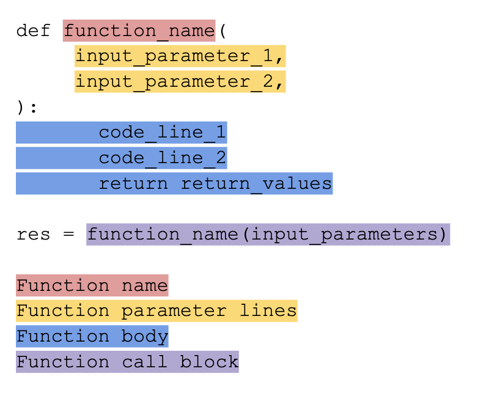

Pipeline Writing (Creating Code)
--------------------------------

This section focuses on the internals of generating modular code for TaskDefinitions that can be used by Pipeline Writers.
For a more high level tutorial on how to write an integration, please check out our integration writing tutorial for contributors.

Definitions
~~~~~~~~~~~

Here is an illustration of some of the components of a function that lineapy can generate for use in writing Pipelines.

Helper Functions
~~~~~~~~~~~~~~~~

UserCodeNodeCollections have a `get_function_definition` which returns a full function from a NodeCollection including the name, input parameters, and function body.
Crucially, this does not contain a function call block.

BaseSessionWriter contains helper utilities to get function name, parameter lines, and bodies for functions that run all the code needed to reproduce a Session.
These functions take in SessionArtifacts as input. 

BaseSessionWriters, also contains helper utilities to generate callblocks for functions created from a NodeCollection, as well as functions that correspond to a full Session.

Usage
~~~~~

BasePipelineWriter uses many of these functions to create the module file, which is meant to be shared and executed by multiple framework implementations.

Any other usages that are framework dag specific should go through the creation of a TaskDefinition and be put in taskgen.
See :code:`taskgen.py` for examples of creating TaskDefinitions.

.. warning::
   Framework specific DAG writers *should not* call these helper functions directly.